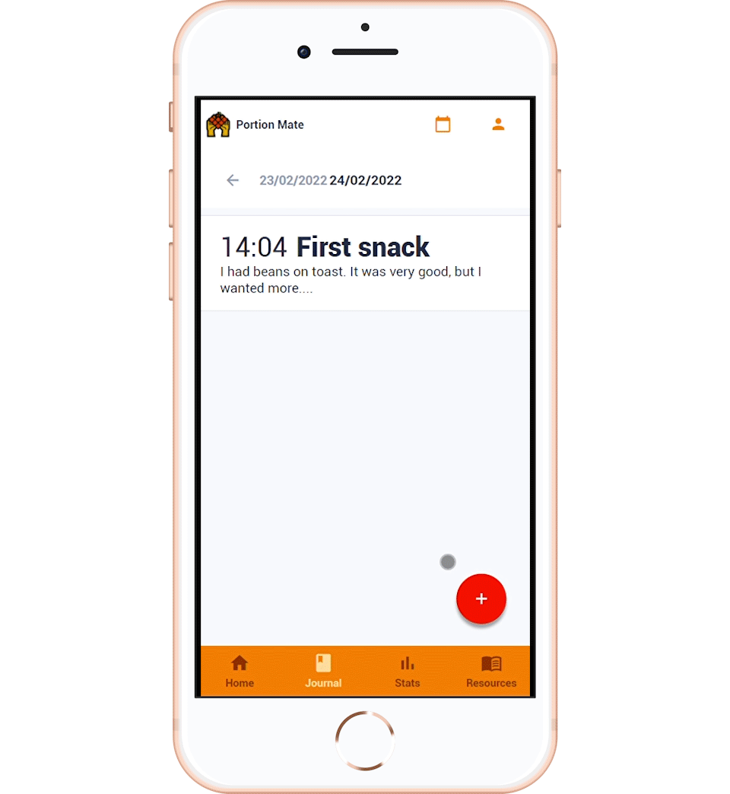
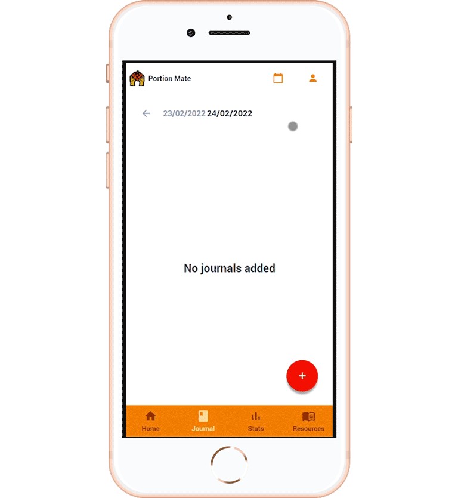
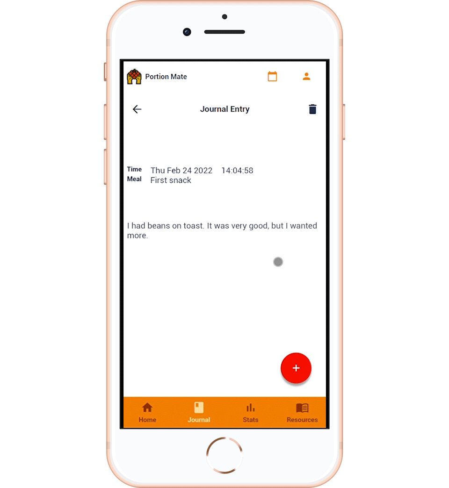

# Journals

Journals allow you to maintain a diary for your diet journey. This could include what you ate and with who - food is a culture! These journals can also help a nutritionist understand you accurately.

On opening the tab, journals for the current day are presented, however, you can navigate to previous days through the top bar, or the calendar icon on the top right.

A journal contains time, meal, and your entry, and can be opened to full view by pressing on it, and exited out by the back button.

To add a journal, you can press the red action button on the bottom right with the "Add Entry" option. This would present fields where you can enter information regarding your journal entry. Additionally, while entering your meals, you can log your portion items at the lower half of the screen instead of having to do so separately.

A journal can be deleted by opening it and pressing the Trash icon on the top right.

