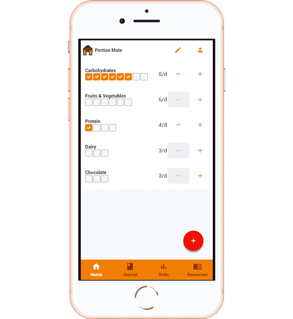
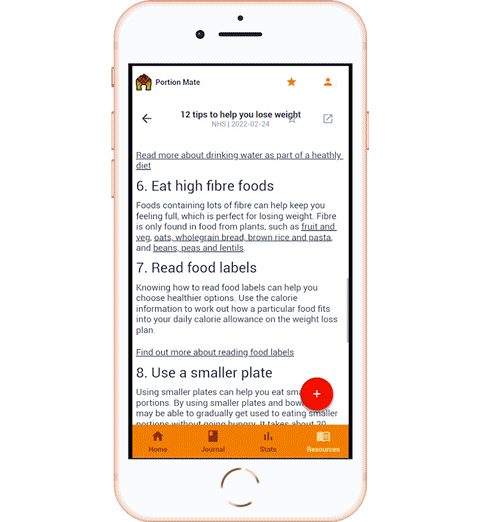

# Resources

The aim for this tab is to provide and share information / awareness about diets. These could include articles, research papers, and guides, and are curated by the administrator(s) to be available to you.

To open a resource, you can press it, and read through. If you want to see the original source, a link will be provided that can be opened from the top right.

The resource can be bookmarked by pressing the star icon, and exit by the back button.

