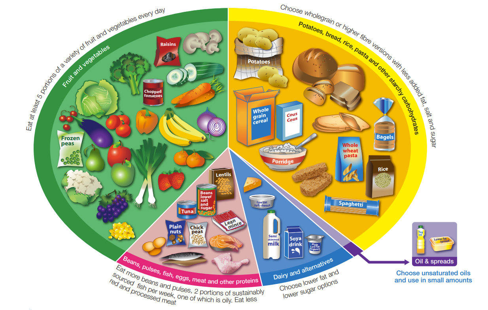

# Statistics

Portion Mate generates and displays graphs for you to visualise your food intake. These graphs can be generated using your logs on particular days and ranges, including "Daily", "Weekly" and "Monthly". For a custom day/range, you can press the calendar icon on the top right.

While graphs may change for different ranges, the important and main one is the Pie Chart which helps to compare your intake to the [Eatwell Guide](https://www.gov.uk/government/publications/the-eatwell-guide) pie chart which constitutes the following:

- **Carbohydrates**: ~33%
- **Fruits & Vegetables**: ~33%
- **Protein**: ~20%
- **Dairy**: ~15%
- **Oils & Fats**: ~5%

